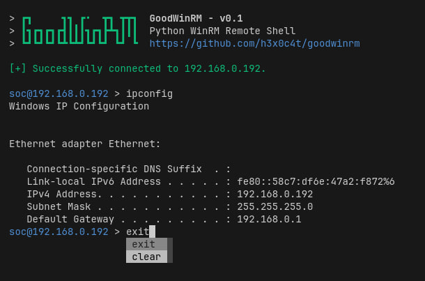

# GoodWinRM

Python WinRM Interactive Shell with file transfer support.



## Features

- Interactive PowerShell over WinRM
- **Password, Pass-The-Hash, Kerberos ccachе auth**
- **File upload / download** (evil-winrm style, base64 chunked)
- Native `ls` / `cd` / `pwd` — preserved directory state per-process

## Installation

```bash
pipx install git+https://github.com/h3x0c4t/goodwinrm
pipx ensurepath
```

## Usage

### Password (NTLM)
```bash
goodwinrm -i 10.10.30.10 -u 'DOMAIN\Administrator' -p 'Password123' -t ntlm
```

### Pass-The-Hash
```bash
goodwinrm -i 10.10.30.10 -u 'Administrator' --nt-hash 'A87E1E9015421162B6D958BBF7453C8D' -t ntlm
```

### Kerberos (ccache)
```bash
export KRB5CCNAME=/tmp/admin.ccache
goodwinrm -i dc.domain.local -u 'admin@DOMAIN.LOCAL' -t kerberos
```

## CLI Options

| Flag                | Description                                   |
|---------------------|-----------------------------------------------|
| `-i`, `--ip`        | Target host (IP or FQDN)                      |
| `-u`, `--username`  | Username (`DOMAIN\User` or `user@DOMAIN`)     |
| `-p`, `--password`  | Password (empty for Kerberos ccache)          |
| `--nt-hash`         | NT hash for Pass-The-Hash (`NT` or `LM:NT`)   |
| `-t`, `--transport` | Auth transport: `ntlm` (default), `kerberos`, `credssp`, `basic`, `ssl`, `certificate` |
| `--https`           | Use HTTPS (port 5986)                         |
| `--port PORT`       | Custom port                                   |
| `-d`, `--directory` | Initial working directory (default `C:\`)     |
| `-v`, `--server_cert_validation` | `ignore` or `validate` (default `ignore`)|

## Shell Commands

| Command         | Description                          |
|-----------------|--------------------------------------|
| `ls [pattern]`  | List files (`Get-ChildItem`)         |
| `cd <path>`     | Change directory                     |
| `pwd`           | Print working directory              |
| `upload local remote`  | Upload file (base64 chunked)   |
| `download remote local` | Download file (base64 chunked) |
| `clear`         | Clear terminal                       |
| `exit`          | Close session                        |

Any other input is executed as a PowerShell command in the current working directory.
